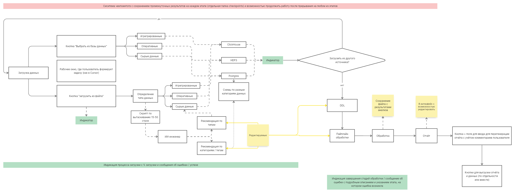
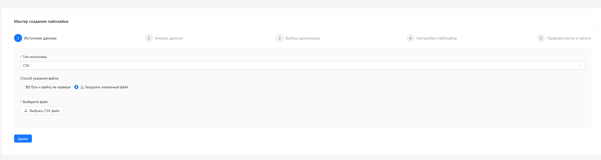
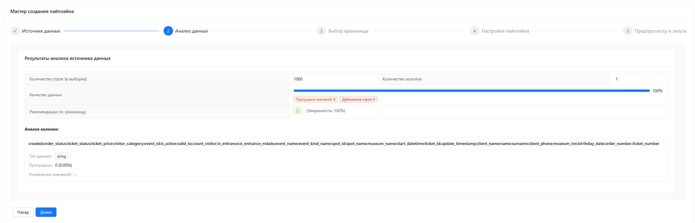
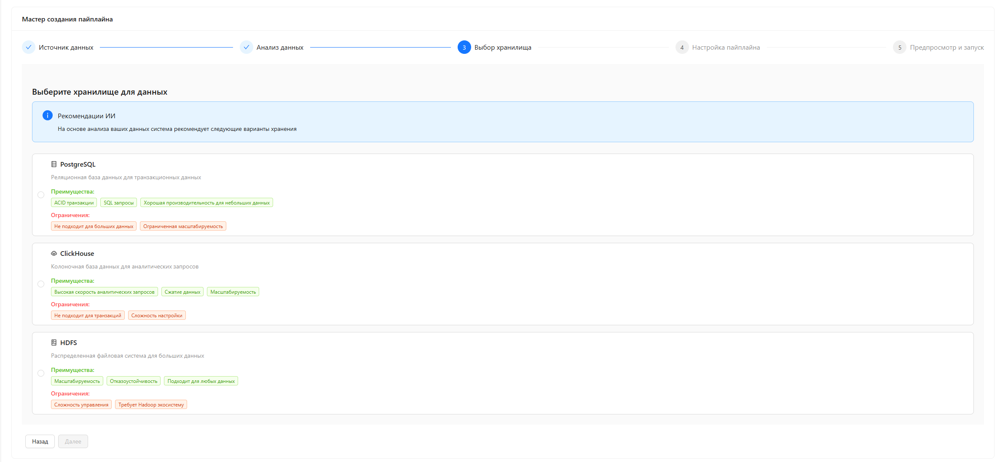
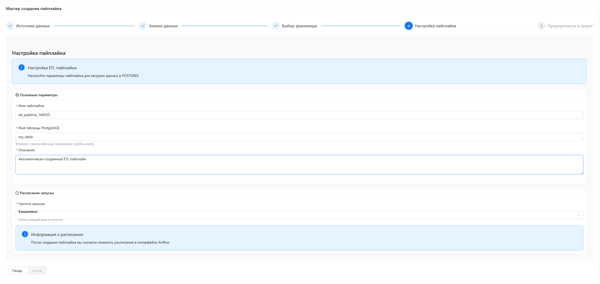
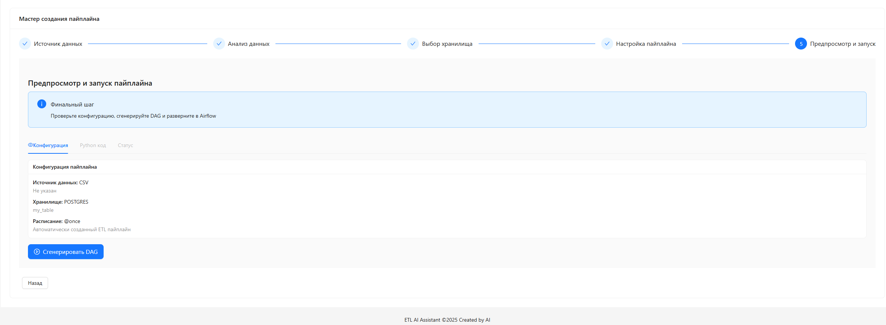

## AI Data Engineer Assistant (локальная LLM через Ollama)

Проект автоматизирует базовые задачи инженера данных на одной локальной LLM (Ollama):
- анализ источника данных;
- рекомендация хранилища;
- генерация DDL;
- генерация ETL‑пайплайна (Airflow DAG);
- финальный отчёт.

## Архитектура
- `backend/` — Django + DRF: API, компилятор DAG, сервисы.
- `frontend/` — React + TypeScript: мастер из 5 шагов.
- `infra/airflow/` — окружение Airflow (webserver, scheduler, init), общие include‑модули для DAG.
- `docker-compose.yml` — сервисы и тома, смонтированы `dags/` и `include/`, задан `PYTHONPATH=/opt/airflow/dags` для импорта `include.*`.



## Интерфейс
- Шаг 1 — выбор источника и загрузка файла
  
  

- Шаг 2 — анализ данных
  
  

- Шаг 3 — выбор хранилища
  
  

- Шаг 4 — настройка пайплайна
  
  

- Шаг 5 — предпросмотр и запуск
  
  

## Быстрый старт (Docker Compose)

### 1) Сборка образов
```bash
docker compose build
```

### 2) Миграции Django (новое приложение `apps.registry`)
```bash
docker compose run --rm backend-api python manage.py makemigrations registry
docker compose run --rm backend-api python manage.py migrate
docker compose run --rm backend-api python manage.py loaddata apps/registry/fixtures/seed_nodes.json
```

### 3) Запуск инфраструктуры
```bash
docker compose up -d postgres clickhouse airflow-init
docker compose up -d airflow-webserver airflow-scheduler backend-api frontend
```

Airflow UI: `http://localhost:8080`

Backend API: `http://localhost:8000`

Frontend: `http://localhost:3000`

## Локальный запуск без Docker (для разработки)

1) Backend (Django)
```bash
cd backend
python -m venv .venv && . .venv/bin/activate  # Windows: .venv\Scripts\activate
pip install -r requirements.txt
export DJANGO_SETTINGS_MODULE=config.settings  # Windows PowerShell: $env:DJANGO_SETTINGS_MODULE="config.settings"
python manage.py migrate
python manage.py loaddata apps/registry/fixtures/seed_nodes.json
python manage.py runserver 0.0.0.0:8000
```

2) Frontend (Vite)
```bash
cd frontend
npm install
npm run dev  # UI по умолчанию на http://localhost:5173
```

3) Airflow (упрощённо)
- для полноценного теста DAG используйте docker‑compose (раздел выше) — он монтирует `dags/` и `include/` и подтягивает провайдеры.

4) Ollama
- установите Ollama локально и загрузите модель:
```bash
ollama pull qwen2.5:14b
```
- укажите URL в `backend/apps/agents/config/general_config.yaml` → `llm_config.ollama.url` на `http://localhost:11434` (если backend тоже локально) и перезапустите backend.

## Запуск в облаке / на VM
- Требуется хост с Docker и открытыми портами 3000 (frontend), 8000 (backend), 8080 (Airflow UI).
- Разверните `docker compose build && docker compose up -d`.
- Ollama можно держать:
  - как отдельный контейнер `ollama` в той же сети compose → URL `http://ollama:11434`;
  - на отдельной VM → пропишите его внешний адрес в `llm_config.ollama.url` и разрешите доступ по 11434.
- Для HTTPS и публикации UI используйте reverse‑proxy (nginx/traefik) — вне рамок текущего README.

## Какие системы подключены
- Frontend (React + Ant Design, Vite) — мастер из 5 шагов.
- Backend (Django + DRF) — REST API, интеграция с LLM, генерация DAG.
- Airflow (webserver, scheduler) — оркестрация DAG; в контейнер проброшены `dags/` и `include/` (импорт `from include.ops...`).
- PostgreSQL (метаданные Airflow) — в compose.
- ClickHouse (демо‑инстанс) — в compose (опционально для проверки генерации DDL/пишущих узлов).
- HDFS single‑node (демо) — в compose (для профиля data lake).
- Ollama — локальная LLM; по умолчанию Qwen 2.5 14B.

## Как работает ИИ‑модель (упрощённая схема)
1) Единый исполнитель `LLMIntegration` вызывает четыре этапа последовательно: `input_analysis → ddl_generation → pipeline_generation → report_generation`.
2) Для каждого этапа `AgentExecutor` подгружает соответствующую секцию из `unified_prompt.yaml` и формирует сообщения:
   - `SystemMessage`: инструкции этапа;
   - `HumanMessage`: контекст, собранный из состояния (`source_config`, `metadata`, `data_sample`, DDL/промежуточные результаты и пр.).
3) Вызов модели идёт через `LLMManager` (только ChatOllama):
   - `model = ChatOllama(model='qwen2.5:14b', base_url=..., temperature=0.75, num_predict=4096)`;
   - `invoke_with_retry()` с простыми ретраями.
4) Ответ LLM парсится и записывается в состояние (рекомендованное хранилище, DDL, код DAG, итоговый отчёт). Состояние визуализируется в UI.
5) Для больших файлов UI использует streaming загрузку (чанки) и лёгкий файл‑анализатор `backend/analyzers/hybrid_file_analyzer.py` — он быстро считает базовые метрики для предпросмотра без тяжёлых библиотек.

## Настройка Ollama

В `backend/apps/agents/config/general_config.yaml` установите URL Ollama:
- если Ollama запущена как контейнер и присоединена к сети docker‑compose — `"http://ollama:11434"`;
- если Ollama запущена на хосте Windows — `"http://host.docker.internal:11434"`.

После изменения перезапустите backend:
```bash
docker compose restart backend-api
```

Проверка из контейнера backend (через Python):
```bash
docker compose exec backend-api python -c "import urllib.request, json; print(json.loads(urllib.request.urlopen('http://ollama:11434/api/tags', timeout=5).read().decode()))"
```

## Поток загрузки больших файлов (Frontend)
- В мастере можно загрузить большой файл (chunked upload). Backend складывает чанки в `FILE_UPLOAD_TEMP_DIR` и объединяет их на этапе `/api/v1/finalize_chunked_upload`.
- Для предпросмотра структура и качества данных считаются минимальным анализатором `backend/analyzers/hybrid_file_analyzer.py`.

## Ключевые файлы
- Конфиг LLM: `backend/apps/agents/config/general_config.yaml`
- Исполнитель: `backend/apps/agents/integration.py` (`LLMIntegration`)
- Менеджер LLM (только Ollama): `backend/apps/agents/core/llm_manager.py`
- Единый промпт: `backend/apps/agents/config/prompts/unified_prompt.yaml`
- Include для DAG: `infra/airflow/include/` (импорты вида `from include.ops.file_io import read_files`)
- Регистр узлов компилятора: `backend/apps/compiler/registry_map.py`
- Реестр узлов (модели + фикстуры): `backend/apps/registry/`

## API (DRF)
Префикс: `/api/v1`
- `POST /analyze` — анализ источника (LLM‑этапы последовательно; вход: `source_type`, `connection_params`).
- `POST /analyze_file_stream` — streaming‑анализ загружаемого файла (используется UI для больших файлов).
- `POST /generate_dag` — генерация Python‑кода DAG из параметров.
- `POST /deploy_dag` — деплой DAG в Airflow.
- `POST /dags/cleanup_orphaned` — очистка «осиротевших» DAG‑файлов.
- `GET /dags/health_report` — отчёт по состоянию DAG‑системы.
