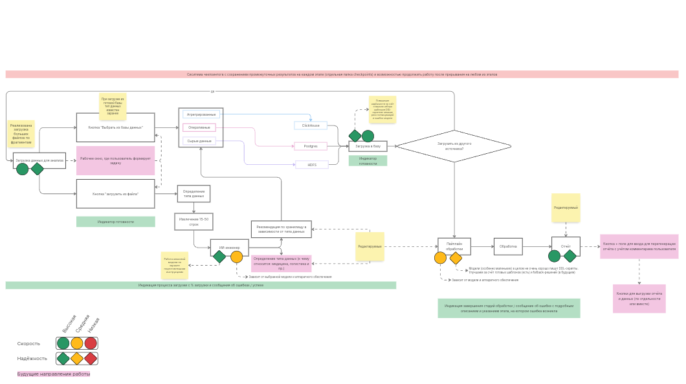

# AI Data Engineer Assistant

Проект представляет собой веб-приложение для автоматической генерации конвейеров обработки данных (ETL/ELT). С помощью локально запущенной LLM (через Ollama) система выполняет задачи, которые обычно решает инженер данных:
- Анализирует исходный файл (CSV, JSON и т.д.).
- Рекомендует оптимальное хранилище данных (ClickHouse, PostgreSQL, HDFS).
- Генерирует DDL-скрипт для создания таблиц в целевом хранилище.
- Создает код Python для ETL-пайплайна (в формате Apache Airflow DAG).
- Генерирует итоговый отчет о проделанной работе.

## Архитектура

Система состоит из нескольких ключевых компонентов, работающих в Docker-контейнерах:

-   **Frontend**: React (Vite) + TypeScript. Реализует пошаговый мастер (wizard) для пользователя.
-   **Backend**: Django + Django REST Framework. Предоставляет REST API, управляет логикой, интегрируется с LLM и генерирует DAG-файлы.
-   **LLM**: Ollama. Обеспечивает работу большой языковой модели локально. По умолчанию используется `qwen2.5:14b`.
-   **Airflow**: Apache Airflow. Система оркестрации для сгенерированных пайплайнов.
-   **Базы данных**: PostgreSQL (для метаданных Airflow и Django) и ClickHouse (как пример целевого хранилища).
-   **Прочее**: HDFS (опционально, для работы с Data Lake), Nginx (прокси для фронтенда).



## Как работает ИИ-модель

Процесс генерации пайплайна разделен на этапы с участием пользователя:

1.  **Загрузка и предварительный анализ**. Пользователь загружает файл с данными. Система анализирует первые 50 строк и извлекает метаданные (колонки, типы, качество данных) без участия LLM.
2.  **Этап 1: Анализ входных данных**. LLM получает образец данных (50 строк) и метаданные. На основе этого она возвращает рекомендации по выбору хранилища данных (например, ClickHouse для аналитики).
3.  **Взаимодействие с пользователем**. Интерфейс отображает рекомендации. Пользователь выбирает целевое хранилище и настраивает параметры будущего пайплайна (расписание запуска, количество повторов и т.д.).
4.  **Этап 2 и 3: Генерация DDL и пайплайна**. Выбор пользователя вместе с исходными метаданными отправляется в LLM. Модель последовательно генерирует DDL-скрипт для создания таблиц и Python-код с логикой ETL-процесса для Airflow.
5.  **Генерация и развертывание DAG**. Система компилирует полученный код в полноценный DAG-файл и размещает его в среде Airflow, где он становится доступен для запуска.
6.  **Этап 4: Генерация отчета**. По запросу пользователя LLM генерирует итоговый отчет, описывающий весь созданный конвейер данных.

## Быстрый старт (Docker Compose)

### Требования
-   Docker
-   Docker Compose

### Запуск

1.  **Соберите и запустите все сервисы:**

    ```bash
    docker compose up -d --build
    ```

2.  **Выполните миграции Django и загрузите начальные данные:**
    Эта команда нужна только при первом запуске или после изменения моделей данных.

    ```bash
    docker compose run --rm backend-api python manage.py migrate
    docker compose run --rm backend-api python manage.py loaddata apps/registry/fixtures/seed_nodes.json
    ```

### Важное замечание о первом запуске

При первом запуске сервис `ollama-init` начнет скачивать языковую модель, указанную в `general_config.yaml` (по умолчанию `qwen2.5:14b`). Это может занять **несколько минут** и потребует значительных ресурсов сети и диска. Пока модель не будет полностью загружена, LLM-часть системы не будет работать. Вы можете следить за процессом в логах контейнера `ollama-init`.

### Доступ к интерфейсам

-   **Веб-интерфейс**: `http://localhost:3000`
    -   **Логин**: `admin`
    -   **Пароль**: `admin`
-   **Airflow UI**: `http://localhost:8080`
    -   **Логин**: `Admin`
    -   **Пароль**: `admin`
-   **Backend API**: `http://localhost:8000/api/v1/`

## Настройка Ollama

URL для подключения к Ollama настраивается в файле `backend/apps/agents/config/general_config.yaml`.

-   При запуске в Docker Compose (по умолчанию): `url: "http://ollama:11434"`
-   Если Ollama запущена на хост-машине (Windows/macOS), а приложение в Docker: `url: "http://host.docker.internal:11434"`

После изменения файла перезапустите бэкенд:
```bash
docker compose restart backend-api
```
